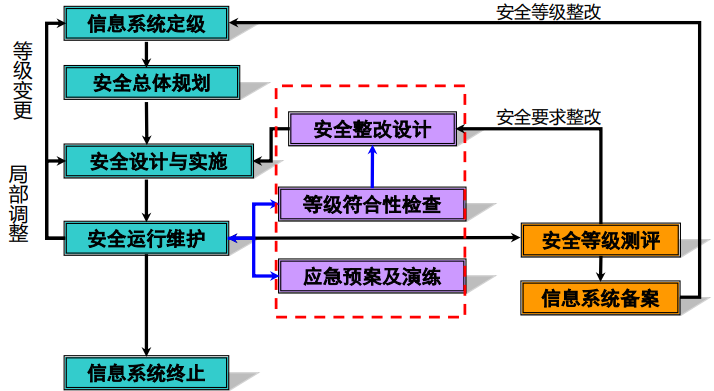

# 前言

1. ※老师没画重点的补充内容
2. ★往年试卷中多次出现或老师提过的，很可能考
3. 该笔记是奔着及格线去的，不是奔着90+
4. 由于没有听过课，部分知识点不一定全，答案不一定完全正确

# 题型

> 试卷有很多题是原题，分值是猜测的

1. 判断题（来源PPT），20分
2. 选择题（来源PPT），30分
3. 问答题，40分
   1. 风险
   2. 等级保护流程
   3. 附加题：手机如何判断和防止窃密窃照？
4. 综合分析题，10分

# 复习重点

> 对着重点看PPT，可以拿80-90分；把给的往年试卷都搞懂，可以拿60-70分

1. 信息安全管理概念、ISMS体系建立过程与步骤
2. **风险**与要素、风险评估过程与计算、详细风险评估概念与流程
3. 环境安全、区域安全、边界划定与栅栏建立、人员安全
4. 业务连续性安全
5. 应急响应与恢复
6. **等保**概念、**流程**、目的，定级过程与标准、定级表、流程图

# 信息安全管理复习笔记

## 信息安全※

### 基本属性

1. 保密性，是指信息不泄漏给非授权的个人和实体，或供其使用的特性；
2. 完整性，是指信息在存储、传输和提取的过程中保持不被修改延迟、不乱序和不丢失的特性；
3. 可用性，是指信息可被合法用户访问并能按要求顺序使用的特性。

## 信息安全管理

### 概念

信息安全管理是通过维护信息的**机密性**、**完整性**和**可用性**等，来管理和保护**信息资产**的一项体制，是对信息安全保障进行**指导**、**规范**和**管理**的一系列**活动和过程**。信息安全管理是**信息安全保障体系建设**的重要组成部分，对于保护信息资产、降低信息系统安全风险、指导信息安全体系建设具有重要作用。

## 信息安全管理体系ISMS★x3

### 定义

信息安全管理体系（Information Security Management System，ISMS）是组织在整体或特定范围内建立的信息安全**方针和目标**，以及完整这些目标所用的**方法和手段**所构成的**体系**。

### 建立过程与步骤

1. ISMS的策划与准备
2. ISMS的文件编制
3. 建立ISM框架
4. ISMS的运行
5. ISMS的审核与评审

## 信息安全风险评估

### 信息安全风险

#### 定义★

**威胁**利用一个或一组**资产的脆弱点**导致**组织受损**的潜在性，并以威胁利用脆弱点造成的一系列不期望发生的事件（**安全事件**）来体现。

#### 基本要素※

资产、威胁、脆弱点

#### 风险与基本要素的关系※

* 没有资产，威胁就没有攻击或损害的对象
* 没有威胁，尽管资产很有价值，脆弱点很严重，安全事件也不会发生
* 系统没有脆弱点，威胁就没有可利用的环节，安全事件也不会发生。

### 七大要素★×4

#### 内容

资产、威胁、脆弱点、风险、影响、安全措施和安全需求

* 资产：是任何对组织有**价值**的东西；
* 威胁：可能导致信息安全**事故**和组织信息**资产损失**的活动，是利用**脆弱性**造成的**后果**；
* 脆弱性：与信息资产有关的**弱点或安全隐患**，本身并不对资产构成危害，但是在一定条件得到满足时，会被威胁利用来危害信息资产；
* 安全措施：可以**降低**威胁利用脆弱性导致安全事件发生的**可能性**；
* 安全风险：是指一种特定的威胁利用一种或一组**脆弱性**造成组织的资产**损失或损害**的**可能性**。

#### 关系

1. **威胁**利用**脆弱点**将导致**风险**的产生；
2. **资产**具有价值，并对组织业务有一定的影响，资产价值及影响越大则其面临的**风险**越大；
3. **安全措施**能抵御威胁、减少**脆弱点**，因而减少**安全风险**；
4. **风险**的存在及对风险的认识导出**安全需求**，安全需求通过**安全措施**来满足或实现。

### 风险计算

风险可形式化的表示为`R=(A, T, V)`，其中R表示风险、 A表示资产、T表示威胁、V表示脆弱点。

`VR=R(A, T, V)=R(L(A, T, V), F(A, T, V))`

* `L(A, T, V)`、`F(A, T, V)`分别表示对应安全事件发生的**可能性**及**影响**
* 风险可表示为可能性L和影响F的函数，简单的处理（平均损失）即`VR= L(A, T, V)×F(A, T, V)`

### 详细风险评估★×1

#### 概念

* 详细风险评估要求对**资产**、**威胁**和**脆弱点**进行详细识别和评价
* 评估可能引起风险的水平：通过不期望事件（**安全事件**）的潜在负面业务影响评估及其发生的可能性来完成。
* 根据风险评估的结果来识别和选择**安全措施**，将风险降低到**可接受**的水平。

#### 流程

1. 风险评估**准备**阶段
2. **资产**识别与评估
3. **威胁**识别与评估
4. **脆弱点**识别与评估
5. 已有安全措施的**确认**
6. 风险**分析**
7. 安全措施的**选取**
8. 风险评估**文件和记录**

> 简化：风险评估准备、风险识别、风险评价、风险处理

### 人员安全管理

#### 定义

与组织或企业的**业务信息系统**相关的人员的安全管理

#### 原则★×2

* 多人负责原则

  每一项与安全有关的活动，都必须有两人或更多人**在场**；

* 任期有限原则

  任何人最好不要长期担任与安全有关的职务，以保持该职务具有**竞争性**和**流动性**；

* 职责分离原则

  出于对安全的考虑，科技开发、生产运行和业务操作都应当职责分离。

### 环境安全

* 机房安全
* 机房内部设施安全
* 机房区域安全
  * 定义：区域安全是组织的**业务场所和信息处理设施**的物理区域的安全保护。
  * 安全区域建立：根据**风险评估**的结果，严格**进出控制**，对重要的信息系统基础设施进行全面的**物理保护**。
  * 安全区域：物理安全边界
  * 安全区域：物理访问控制
  * 办公场所和设备保护
  * 外部或环境的威胁防范
  * 安全区域工作
  * 区域隔离
* 机房安全区域测评

## 业务连续性管理BCM

### 定义

Business Continuity Management，业务连续性管理是对机构或组织的**潜在风险**加以评估分析，确定其可能造成的**威胁**，并建立一个**完善的管理机制**来防止或减少灾难事件给组织带来的**损失**。

### 应急响应

#### 定义

指一个组织为了应对各种意外事件的发生所做的**准备**以及在事件发生**初期**所采取的**措施**。

#### 应急响应方法学—恢复(Recovery)

##### 定义

在安全事件的根源根除以后，恢复阶段定义下一阶段的行动。

##### 目标

把所有被攻破的系统和网络设备彻底地**还原**到它们**正常**的任务状态。

## 信息安全等级保护

### 概念

是对信息和信息载体按照**重要性等级分级别进行保护**的一种信息安全领域的工作

### 流程★

1. 定级
2. 备案
3. 安全建设和整改
4. 信息安全等级测评
5. 信息安全检查。

### 目的★

* 体现国家管理意志
* 构建国家信息安全保障体系
* 保障信息化发展和维护国家安全

### 等保建设与整改完全实施流程

### 定级要素与安保等级关系

> 也许这个叫做“安全等级矩阵表”

### 十大核心标准

### 流程图

# 易错题

> 试卷中没有涉及到上述总结的重点的题目放在此处

## 判断题

> 主要收集试卷中错误的言论

1. 信息安全保障阶段中，安全策略是==~~核心~~==，对事先保护、事发检测和响应（事发处理）、事后恢复起到了统一指导作用。★x3

   >指导作用

2. 一旦发现计算机违法犯罪案件，信息系统所有者应当在==~~2 天~~==内迅速向当地公安机关报案， 并配合公安机关的取证和调查。

   > 24h内

3. 我国刑法中有关计算机犯罪的规定，定义了 ==~~3 种~~==新的犯罪类型

   > 三种计算机犯罪，只有两种新的犯罪类型

4. 网络安全法开始实行的时间是2017年6月1日

5. 信息安全评测系统 CC 是==~~国内~~==标准。

   > 国际

6. “资产责任人”是指有权限变更资产安全属性的人。★x2

7. 《信息系统安全等级保护测评准则》将测评分为安全控制测试和系统整体测试两个方面。

8. 安全审计跟踪是 审计 安全事件 并 追踪 系统安全检测 的过程。 ×

   > 安全审计追踪是 安全审计系统 检测并追踪 安全事件 的过程。

9. 组织的安全要求==~~全部~~==来源于风险评估

   > gpt 3.5：信息安全管理需要综合考虑各种因素，包括但不限于风险评估，以制定全面有效的安全要求。这些要求应该涵盖组织的整体安全策略、控制措施、安全意识培训、安全政策等方面，以确保组织的信息资产得到适当的保护。

10.  “资产责任人“，要求与信息处理设施有关的所有资产==~~都~~==应由指定人员承担责任。

  > gpt 3.5：资产责任应当分散到不同的人员和部门，以确保合理的管理和保护。

11. 审核范围==~~必须~~==与受审核方信息安全管理体系范围一致

    > 一次具体审核的审核范围与认证范围并非一定完全一致。一般初次认证的审核范围可能大于认证范围

12. 为了工作方便和工作效率，在内审时内审员==~~可以~~==审核自己的工作。

13. 与信息资产有关的弱点或安全隐患对资产构成威胁 ×

14. （学习通作业）网络攻击的难点是漏洞挖掘和权限获取。 ×

15. 信息安全领域内最关键和最薄弱的环节是==~~技术和管理制度~~==

    > 人

16. 保护关键业务过程免受信息系统失误或灾难的影响，应定义恢复的优先顺序和时间指标。

## 选择题

1. 信息安全经历了三个发展阶段，以下(B)不属于这三个发展阶段。★x2

   A. 通信保密阶段 B. 加密机阶段 C. 信息安全阶段 D. 安全保障阶段

2. 风险评估过程中的预防性控制措施是（D）。★x2

   A. 强制访问控制 B. 告警 C. 审核活动 D. 入侵监测方法

3. 在建立信息安全管理体系时，首先应该做的事情是（B）。★x3

   A. 风险评估 B. 建立信息安全方针和目标 C. 风险管理 D. 制定安全策略

4. 信息安全管理体系是 PDCA 动态持续改进的一个循环体。下面理解不正确的是（B）。★x4

   A. 组织中的每个部分或个人，均可以 PDCA 循环，大环套小环，一层一层地解决问题。
   B. 推动 PDCA 循环，关键在 P 这个计划阶段。
   C. 每通过一次 PDCA 循环，都要进行总结，提出新目标，再进行第二次 PDCA 循环。
   D. 按顺序进行，它靠组织的力量来推动，像车轮一样向前进，周而复始，不断循环。

   >PDCA：Plan(计划)、Do(执行)、Check(检查)和Action(处理)

5. 电源是计算机网络系统的命脉，计算机机房后备电源应选择（A）★x2

   A. UPS B. 发电机 C. 蓄电池 D. 干电池

   > *UPS*即不间断*电源*(Uninterruptible Power Supply)，是一种含有储能装置的不间断*电源*。主要用于给部分对*电源*稳定性要求较高的设备，提供不间断的*电源*。

6. 窃听技术是在窃听活动中使用的窃听设备和窃听方法的总称。不用中继技术窃听距离最远的技术是(A)。 ★x2

   A. 谐波无线窃听 B. 微波窃听 C. 激光窃听  D. 电话窃听 E. 定向麦克风 F. 外墙音频放大

7. 计算机信息系统安全等级保护的等级是由 (B) 确定。

   A. 计算机信息系统面临的风险
   B. 计算机信息系统资源的经济和社会价值及其面临的风险
   C. 计算机信息系统价值
   D. 以上都不是

8. 业务连续性管理 (BCM) 的原则是预防为先，恢复为后，其中预防的目的是(C)。★x5

  A. 减少威胁的可能性
  B. 保护企业的弱点区域
  C. 减少灾难发生的可能性
  D. 防御危险的发生并降低其影响

9. 信息安全管理领域权威的标准是（B）。

  A. ISO 15408 B. ISO 17799/ISO 27001(英） C. ISO 9001 D. ISO 14001

10. 在策略生命周期中，以下哪个是正确的：(D) ★x3

  A. 需求分析、制定、发布、推行、审核、废除
  B. 制定、发布、推行、审核、修订、废除
  C. 需求分析、制定、发布、推行、审核、修订
  D. 需求分析、制定、发布、推行、审核、修订、废除

11. 区域安全管理中下面哪个描述是错误的？（C）★x2

    A. 安全区域保护可采用围墙和门控，警卫、智能锁、电子监视和警报系统都是适当措施。
    B. 隔离送货区域、装载区域、信息处理设施，控制授权访问。
    C. 敏感信息处理设施的位置标示==~~引人注目~~==，安装监控。
    D. 来访人员进入需要审批并记录。

12. 对于信息安全管理中的人力资源安全，以下理解不正确的是（B）★x3。

    A. 上岗前要对担任敏感和重要岗位的人员要考察其以往的违法违规记录
    B. 雇佣中要有==~~及时有效~~==的惩戒措施
    C. 出了事故后要有针对性地进行信息安全意识教育和技能培训
    D. 离职人员要撤销其访问权限

13. 信息安全的符合性检查不包括（D）★x2

    A. 法律法规符合性 B. 技术标准符合性  C. 安全策略符合性 D. 内部审核活动

14. 1999 年我国发布的信息安全等级保护国家标准 GB 17859-1999 参考了美国的 TCSEC 标准，将信息系统的安全等级划分为（5）个等级。

15. 最终提交给普通终端用户，并且要求其签署和遵守的安全策略是（C）。

    A. 口令策略 B. 保密协议 C. 可接受使用策略 D. 责任追究制度

16. 在完成大部分策略编制工作后，需对其进行总结和提炼，产生的成果文档称为(A)

    A.可接受使用策略AUP B.安全方针 C.适用性声明 D.操作规范

17. 互联网服务提供者和联网使用单位落实的记录留存技术措施，应当具有至少保存（60）天记录备份的功能。

18. （D）属于系统威胁。

    a)不稳定的电力供应 b)硬件维护失误 c)软件缺乏审计记录 d)口令管理机制薄弱

19. 管理体系是指（指挥和控制组织的协调的活动）

20. 风险评价是指（B）

    A.系统地使用信息来识别风险来源和评估风险
    B.将估算的风险与给定的风险准则加以比较以确定风险严重性的过程
    C.指导和控制一个组织相关风险的协调活动
    D.以上都对

21. 在信息系统安全中,资产所具备的风险由以下哪两种因素共同构成的(C)

    A.攻击和脆弱性 B.威胁和攻击 C.威胁和脆弱性 D.威胁和破坏

22. 移动存储介质的管理和使用应防止（ABCD）

    A. 信息失效 B. 病毒危害 C. 公私混用 D. 遗失、被盗

23. （学习通作业）下面哪项不是网络威胁的原因。（B）

    - A.信息数字化网络化价值化
    - B.信息安全存储
    - C.信息访问控制失败
    - D.威胁有动机，攻击技术易获得

24. （学习通作业）按攻击方式，攻击类型可分为被动攻击和主动攻击，被动攻击难以（ ），然而（ ）这些攻击是可行的；主动攻击难以（ ），然而（ ）这些攻击是可行的。（C）

    A. 检测，阻止，检测，阻止
    B. 阻止，检测，检测，阻止
    C. 检测，阻止，阻止，检测
    D. 阻止，检测，阻止，检测

25. （学习通作业）关于口令攻击的说法错误的是（D）。
    A. 口令破解包括字典破解、穷举破解、组合破解、彩虹表破解、猜测破解；
    B. 口令套取包括权威逼取、友情索取、利诱骗取、窥视、盗取；
    C. 撞库攻击是假设大量系统用户使用相同的密码注册，过程包括拖库、洗库和撞库；
    D. 口令屏蔽包括SQL注入、URL注入、重放攻击、堆栈溢出攻击、欺骗攻击。

    > GPT 3.5：口令屏蔽是一种防范口令攻击的措施，它涉及一系列技术和策略，如密码策略、多因素认证、防止暴力破解等，但不包括上述提到的攻击方式。

26. 通用准则 CC 标准分为三个部分，以下不属于这三部分的是 。（D）

    A. 简介和一般模型 B. 安全保证要求 C. 安全功能要求 D. 保密性要求

27. 物理安全包括（C）

    A. 设备安全、介质安全、系统安全、环境安全
    B. 设备安全、系统安全、环境安全、人员安全
    C. 设备安全、介质安全、环境安全、人员安全
    D. 设备安全、网络安全、环境安全、系统安全

28. 应急响应是组织为应对各种意外事件的发生所做的准备和采取的措施，方法顺序（A）

    A. 准备、检测、抑制、根除、恢复、跟踪 B. 准备、跟踪、检测、抑制、根除、恢复 C. 准备、检测、跟踪、抑制、恢复、根除 D. 准备、抑制、根除、恢复、检测、跟踪

29. 风险评估主要包括以下哪几个方面的评估？（B）

    A. 资产、威胁、弱点
    B. 资产及价值、威胁、弱点、已有控制措施
    C. 资产及价值、威胁、弱点
    D. 资产、威胁、弱点、已有控制措施

30. 人员安全管理原则不包括 (C) 。

    A. 多人负责 B. 任期有限 C. 授权管理 D. 职责分离

31. 下面哪个不是信息资产的保护措施？（B）

    A. 编制资产清单 B. 分类标记 C. 指定责任人 D. 清查盘点

32. 英国 ITIL 的核心模块是服务管理，下面哪个不属于服务提供管理流程？（C）

    A. 服务级别管理 B. 可用性管理 C. 发布管理 D. 服务财务管理

33. 当某个软件包的最新版本被安装到某个台式机时，它可能会影响其它软件包。哪个流 程负责检查和判断其它软件包是否有必要测试或者重新安装？ （A）

    A. 发布管理 B. IT 服务持续性管理 C. 问题管理 D. 变更管理

34. ITIL 安全事件监控的主要工作不包括（A）

    A. 日志审计 B. 关联分析 C. 安全事件知识库 D.建立统一管理平台

35. 安全审计流程不包括（C）

    A. 事件采集 B. 事件分析 C. 事件监控 D. 事件响应

36. 信息安全等级保护工作的主要内容包括五个方面（B）。

    A. 策略、管理制度、技术、设备、测评
    B. 定级、备案、测评、建设整改、检查
    C. 定级、策略、设备、测评、检查
    D. 策略、定级、备案、测评、建设整改

## 问答题

1. ISO27001 所关注的 11 大领域是什么？

   信息安全 11 大管理领域： 安全方针/策略、信息安全组织、资产管理、人力资源安全、物理与环境安全、通信和运作管理、访问控制、信息系统开发与维护、信息安全事件管理、业务连续性管理、法律法规符合性。

2. 信息系统生命周期包括哪 5 个阶段？信息系统安全等级分哪几级？与系统生命周期对应的安全等级保护实施过程是什么？★x2

   1. 信息系统生命周期包括 5 个阶段

      启动准备、设计/开发、实施/实现、运行维护和系统终止阶段。

   2. 信息系统安全等级分 5 级

      1－自主保护级，2－指导保护级，3－监督保护级，4－强制 保护级，5－专控保护级。 

   3. 信息系统安全等级保护措施

      自主保护、同步建设、重点保护、适当调整。

   4. 与信息系统生命周期对应的等级保护实施过程有 5 步：

      系统定级、安全规则、安全实施、安全运行维护和系统终止。

3. （学习通作业）试述网络安全防范的三种模型。

   1. 边界保护模型（Perimeter Security Model）

      这种模型将**网络的安全边界**设定为网络的入口和出口，对进出网络的数据流进行过滤和检查，以防止未经授权的访问和攻击。它主要包括防火墙、入侵检测系统（IDS）和入侵防御系统（IPS）等安全设备。

   2. 层次防御模型（Layered Security Model）

      这种模型将网络划分为**多个层次**，每个层次都有**不同的**安全策略和保护措施。这种模型将安全任务划分为多个较小的部分，每个部分都可以**独立管理和控制**。例如，可以分别对网络层、应用层和数据层进行防御。

   3. 动态防御模型（Dynamic Security Model）

      这种模型强调对网络安全的**持续监控和适应**，它可以根据网络的使用情况和威胁的变化来**动态调整**安全策略和防御措施。这种模型通常使用安全信息和事件管理（SIEM）系统、端点安全解决方案、行为分析等技术来实现。

4. 信息系统安全等保测评的目的是什么？如何确定其安全等级？试画出安全等级矩阵表。★x2

5. 试画图说明等级保护的基本安全要求和等级保护的完全实施流程。

## 综合分析题

1. 查某公司设备资产，负责人说台式机放在办公室，办公室做了来自环境的威胁的预防；笔记本经常带入带出，有时在家工作，领导同意了，在家也没什么不安全的。请从信息安全管理上分析。★x2

   组织场所外的设备安全，应对组织场所的设备采取安全措施，要考虑工作在组织场所以外的不同风险。

   1. 笔记本带出办公室，有**丢失**、被**非法访问**风险；采取**随身锁**的安全措施；
   2. 在家里使用，有感染**病毒**、**泄露**单位重要文件信息的风险；采取隔离家庭网络或防火墙、杀毒防护措施；
   3. 染毒的笔记本带回办公室，有**交叉感染**办公室台式电脑的风险，有交叉拷贝数据文 件被**泄露**的风险；采取严格的杀毒与隔离措施。
   4. 如果工作有较高等级涉密信息，**严禁**将电脑**带出**办公室，并**严管 U 盘**使用，避免“摆渡”APT 攻击。
   5. 定期对单位进行信息安全管理**培训**，增强领导和员工的信息**安全意识**。

2. 假设您是某企业的 CIO，请就本单位的人员使用、升迁或离职、新员工招聘谈谈如何进行信息安全管理。★x2

   * 对于内部工作人员，采取分级授权**访问控制**措施，对于敏感数据和文件进行**分级**管理；
   * 员工升迁后，将收回设备、系统 ID 并根据级别**重新授权**；
   * 员工离职后，**收回**设备或由技术主管**销毁**设备上的信息，收回系统 ID 及其访问权限；
   * 新员工入职：对员工进行信息安全**培训**，**对应**级别进行访问**授权**。

3. 口令认证 (Password authentication) 方式因其简单易用被广泛应用于各种信息系统中，但口令管理不当会带来很大的安全隐患。根据所学的信息安全知识，请你设计一套口令管理的基本原则

   1. 设置的口令尽可能复杂，口令至少包含字母、数字和标点符号、一些其他的字符组合。
   2. 口令的长度至少8位,不要将口令写下来。
   3. 不要将口令存于终端功能键或调制解调器的字段串存储器中。
   4. 不要选取显而易见的信息作口令。
   5. 不要让人知道,不要让人看见自己在输入口令。
   6. 不要交替使用两个口令。
   7. 不要在不同系统上使用同一个口令。
   8. 定期更改口令。

4. 

## 附加题

1. 就手机的使用谈谈如何进行信息安全管理。（如：APP 的下载、安装和使用过程，以及共享充电、公共 WIFI、防窃听窃照、APP权限等）

   > GPT 3.5

   1. APP的下载、安装和使用过程：

      - 从官方应用商店下载APP

        尽量避免从第三方来源下载APP，因为官方应用商店会对APP进行安全审核和筛选。

      - 核对APP权限

        在下载和安装APP之前，仔细审查所需的权限列表，并确保APP仅获得合理必要的权限。

      - 更新APP

        定期更新已安装的APP，因为更新通常包含安全补丁和修复已知漏洞。

   2. 共享充电：

      - 不使用不可信的充电设备

        避免使用未知来源或不可信的充电器、充电宝等设备，以防止恶意软件注入或数据泄露。

      - 使用数据线充电

        尽量使用数据线连接到电源插座而非USB接口，因为数据线只传输电力而不传输数据，可以减少潜在的风险。

   3. 公共WIFI：

      - 谨慎使用公共WIFI

        公共WIFI网络存在安全风险，可能会被黑客窃听或中间人攻击。尽量避免在公共WIFI网络上进行敏感的在线活动，如银行交易或输入密码。

      - 使用VPN加密

        如果必须使用公共WIFI，建议使用可靠的VPN（虚拟专用网络）服务，以加密通信并保护个人数据的安全。

   4. 防窃听窃照：

      - 定期检查应用权限

        定期审查已安装的应用程序的权限，限制敏感权限（如麦克风、相机）的使用，以防止未经授权的窃听和窃照。

      - 物理保护

        注意手机的物理安全，避免将手机置于不安全的环境中，以防止他人进行非法窃听或窃照。

   5. APP权限：

      - 审查APP权限

        在安装APP之前，仔细审查所需的权限列表。只授予合理必要的权限，并关注敏感权限的使用，如通讯录、位置信息、短信等。

      - 权限管理

        定期审查已安装的APP权限，撤销不再需要的权限，以减少潜在的数据泄露和滥用风险。

2. 手机如何判断和防止窃密窃照？

   > GOT 3.5

   1. 判断

      1. **异常数据使用情况：**
        
         监控手机的数据使用情况。如果你注意到未经授权的应用程序大量使用数据，这可能是窃密活动的迹象。
         
      2. **电池耗尽速度：**
        
         异常的电池耗尽速度可能表明某些应用程序在后台运行，可能是用于监视或窃取信息。
         
      3. **应用权限变更：**
        
         定期审查应用程序的权限，特别是如果你注意到某个应用程序在未经明示的情况下请求额外的权限，这可能是一个警告信号。
         
      4. **网络活动监控：**
        
         使用网络监控工具检查手机的网络活动。不寻常的数据传输活动可能表明潜在的窃密行为。
         
      5. **异常热度：**
        
         如果手机变得异常热，可能是因为某个应用程序在后台运行，执行不寻常的任务，如窃密或窃照。
         
      6. **设备行为变化：**
        
         如果手机的行为出现显著变化，比如频繁崩溃、关机或重新启动，可能是受到了恶意活动的影响。
         
      7. **不明来源的通知和消息：**
        
         注意不明来源的通知、短信或消息，尤其是涉及个人信息或敏感操作的。
         
      8. **审查应用列表：**
        
         定期审查手机上安装的应用列表，删除不必要或不信任的应用程序。
         
      9. **安全软件扫描：**
        
         使用信任的安全软件对手机进行定期扫描，以检测潜在的威胁。
         
      10. **设备定位检查：**
        
          检查手机的定位历史，确保没有不明设备在未经允许的情况下访问你的手机。

   2. 防止

      1. **密码和生物识别技术：**
        
         - 使用强密码或者密码短语来保护你的手机。避免使用容易猜测的密码，如生日或者简单的数字。
         - 启用手机上的生物识别技术，如指纹识别或面部识别，以提高访问安全性。
         
      2. **更新操作系统和应用程序：**
        
         及时更新手机的操作系统和应用程序，以确保安全漏洞得到及时修补。
         
      3. **应用权限管理：**
        
         审查并管理应用程序的权限。只授予应用程序合理需要的权限，防止恶意应用获取不必要的权限。
         
      4. **使用安全连接：**
        
         避免在公共无线网络上进行敏感操作，如银行交易。使用虚拟私人网络（VPN）可以加密你的网络连接，增加安全性。
         
      5. **远程定位和擦除功能：**
        
         启用手机的远程定位和擦除功能，以便在手机丢失或被盗时能够远程锁定、定位或擦除手机中的数据。
         
      6. **防病毒和安全应用：**
        
         安装信任的安全应用程序，包括防病毒软件，以保护手机免受恶意软件和病毒的侵害。
         
      7. **警惕钓鱼和恶意链接：**
        
         避免点击不信任的链接，尤其是通过短信或电子邮件收到的链接。这有助于防止恶意软件的安装。
         
      8. **摄像头和麦克风管理：**
        
         审查应用程序的权限，确保只有需要使用摄像头和麦克风的应用才能访问这些设备。
         
      9. **物理安全：**
        
         当不使用手机时，确保将其锁定或者放在安全的地方，以防止他人访问。
         
      10. **教育用户：**
        
          提高用户对安全威胁的认识，教育他们如何辨别恶意活动，并采取必要的预防措施。
